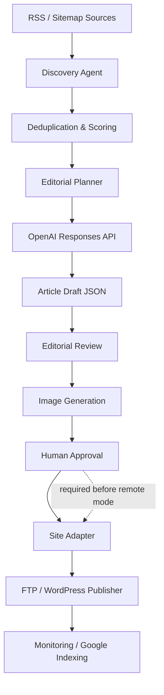

# Satellite Publisher architecture

This public repository is a sanitised, dry-run demonstration. It deliberately
contains no production websites, feeds, credentials, publication history or
server details.

## Safety boundary

`DRY_RUN=true` is the default. In this mode, publication, WordPress requests
and Google indexing are blocked. The public demo uses fictional RSS records and
generates local preview output only.

## Responsible discovery boundary

The discovery module limits source material to title, canonical URL, author or
date when available, and a short RSS excerpt (700 characters maximum). The
public workflow does not fetch or transmit full source articles. Generated
copy is reviewed for text overlap and requires human approval.

## Optional integrations

- OpenAI Responses API: editorial planning, generation and review.
- OpenAI Images API: supporting editorial imagery.
- ScrapingDog: optional SERP enrichment; not needed for the default flow.
- FTP via `curl` and WordPress REST bridges: destination adapters.
- Google Indexing API and Search Console URL Inspection API: optional
  post-publication monitoring, disabled by dry-run.
